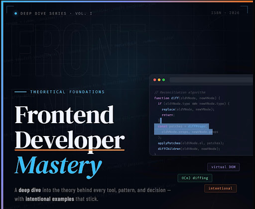
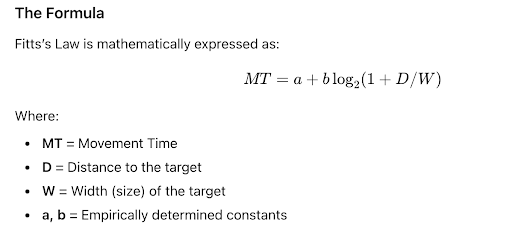
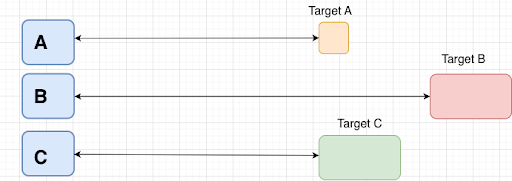
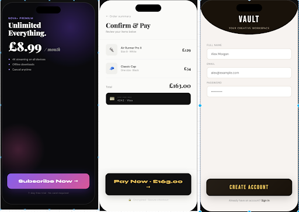
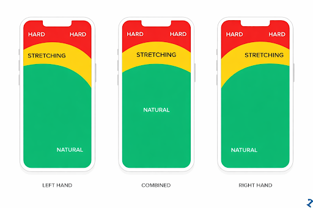
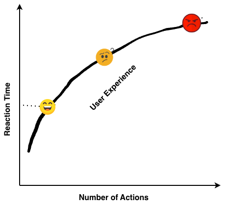
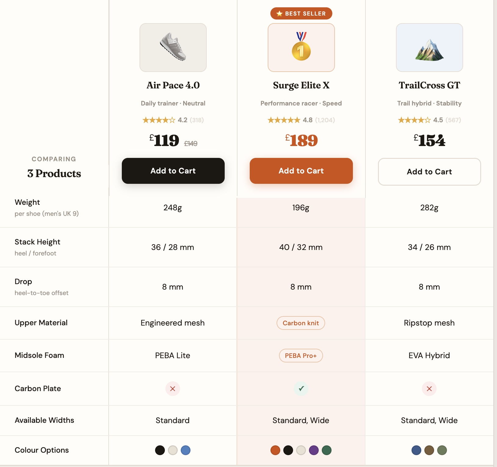
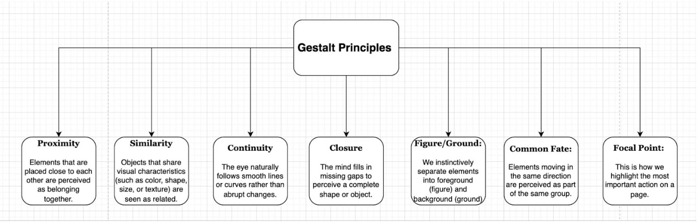
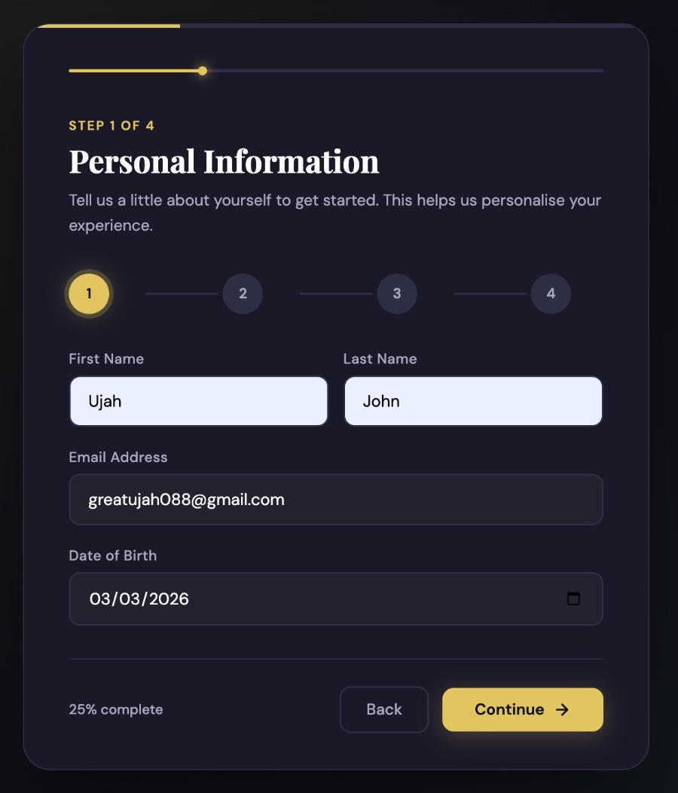

# A deep dive of Theoretical Foundations for Frontend Developer Mastery with intentional examples.

Have you ever abandoned an app right at the sign‑up page? Or felt uneasy navigating a website because the buttons were scattered randomly, the colors clashed, and the layout felt confusing and unnecessarily complex? Maybe you were asked to complete twenty fields in one go. You carefully fill everything out, hit Submit — and only then are you told your password doesn’t meet some hidden, unspoken requirement. A requirement that was never communicated upfront.

Requirements that were never clearly stated from the beginning. Instead of helpful guidance, you’re met with a vague message: “Invalid input.
Invalid how, you wonder.

Required fields weren’t marked. There was no real‑time validation. No helpful red outline showing which field was wrong. Just a generic prompt telling you to “go back and correct missing information,” as if you’re supposed to magically know what the system wants.

So you scroll. You search. You guess.
And you are now already getting frustrated. 
The reason you are frustrated is simple, no one enjoys repeating a task they thought they had already completed — especially when the mistakes could have been prevented with clear guidance along the way.
Also, you manage to fill in the form and you tap the Submit button.
Nothing happens.
No loading spinner.
No subtle animation.
No confirmation message.
No success screen.
Just silence.
For a brief moment, you’re left wondering: Did it go through?
So you tap again. And maybe… one more time.
At this point, you become fed up and either postpone the signup process to when you have the time, and as usual, most may not return unless it’s really important to them.
Even if you haven’t experienced this exact scenario, you’ve almost certainly felt the same kind of friction — that moment when a digital interface makes you pause, hesitate, or wonder what you’re supposed to do next.

These frustrations often arise because frontend developers either overlook or are unaware of the essential design principles and theories that underpin a smooth, intuitive user experience. As a frontend developer, your interface should minimise cognitive load, provide immediate clarity, and guide users effortlessly through every task.

In this article, I will introduce the academic theories that should inform and elevate your frontend decisions. You might wonder: What do academic theories have to do with frontend development? The answer is simple. Academic theories are not abstract ideas; they are the result of rigorous scientific investigation — controlled experiments, validated models, and decades of research into how humans think, learn, perceive, and interact with information.

Because these theories are grounded in evidence rather than opinion, they offer reliable guidance for building interfaces that align with how the human brain actually processes information. Applying them to frontend development means you are not designing by guesswork or personal preference; you are applying tested, scientific insights to create clearer, faster, more humane user experiences.

In other words, when you build with academic theory in mind, your frontend becomes more than just visually appealing — it becomes cognitively efficient, behaviourally aligned, and measurably easier for users to navigate.

Based on the sentiment above, the following laws will guide your development. Let’s start by looking at Fitt’s law.

**Fitts’s Law:** 

Fitt’s law is a brainchild of Paul Fitts. He was among the early psychologists who recognised that many human errors result from flawed design rather than simple human weakness. During World War II, he studied airplane cockpit layouts and concluded that numerous incidents attributed to pilot error were actually caused by poor design decisions. Based on his findings, he postulated that the time required to acquire/reach a target is determined by the distance to the target and the size of the target. See diagram illustration below.

From the above, between Target B and Target C, it will be faster to interact with Target C than Target B simply because of the distance (Target B is farther away). Interestingly, though Target A and Target C are at the same distance, Target C will still be faster to interact with and less error-prone because of its larger size. 

In simple terms, Fitt’s Law tells us that the time required to move to a target depends on two main factors: the distance to the target and the size of the target. The farther away an element is, the longer it takes to reach. The smaller it is, the more precision it demands thereby increasing interaction time and the likelihood of errors. Conversely, closer and larger targets reduce cognitive load, motor effort, and frustration.

In a nutshell, Fitts’s main message to developers is to reduce the distance users must travel on the screen and to make important buttons large and visually dominant. Imagine placing a submit button at the top-right corner of the screen. After a user finishes filling out a long form, they must then move their cursor or thumb all the way back to the top-right corner just to submit the form. Ideally, the best place to position the submit button is at the bottom, where the form ends. Another example of this is - placing the related buttons like “Add to Cart” button and “Check out Button” in opposite directions. This will cause extra thumb movement across the screen, thereby increasing interaction.

Design Takeaway from Fitt’s Law: As a frontend developer, you should always ensure your targets (by target I mean primary buttons/(Call-to-action buttons) such as "Subscribe Now," "Pay Now," "Create Account," or "Sign Up") are large and visually dominant. I strongly recommend making the Call-to-Action (CTA) the most recognisable button on the screen. Additionally, place your CTA buttons in a natural position that feels convenient for the user. Specifically, place your targets close to the thumb. It is much faster for a user to interact within the "natural zone" than the "hard zone" (see figure). Also use padding to increase the interactive area. By doing this, you are increasing the size of the targets.

Now imagine a menu that disappears the moment your cursor drifts a few inches away. You’re not trying to close it — you simply moved slightly, and suddenly the entire menu collapses. That tiny slip forces you to start the interaction all over again. It’s a small mistake, but it creates a disproportionately frustrating experience.
This happens because the interactive area is too narrow. 
That’s why effective padding — or more broadly, generous interactive zones — is essential. By increasing the clickable or hoverable area around a menu, you are increasing the size of the targets, which makes the interaction more stable, more forgiving, and far less cognitively demanding. Users can move naturally without fear of accidentally “falling off” the target.

When a menu collapses too easily, the interface is essentially saying:
“You must be perfect.”  
Good UX says the opposite:
“You can be human.”

Another fundamental principle that also emerges from Fitt’s Law is the idea of infinite targets. When an interface element is placed at the very edge or corner of a screen, it becomes effectively “infinite” because the cursor cannot move beyond the screen boundary. The edge acts as a physical barrier, allowing the user to fling the mouse in that direction without precision or careful aiming. As a result, corners and edges become the fastest, easiest, and most reliable places for users to access important controls.

This is why operating systems such as Apple’s macOS and Microsoft Windows position their most essential menus and buttons at these locations. The macOS Apple Menu sits in the top‑left corner, Windows historically placed the Start button in the bottom‑left corner, and both systems anchor taskbars, docks, and notification areas along screen edges. These placements reduce cognitive load, minimise motor effort, and increase interaction speed because users do not need to slow down or correct their cursor movement. The screen itself “catches” the pointer.

In essence, infinite targets transform small interface elements into large, easy‑to‑hit zones simply by leveraging the geometry of the screen. What this means for developers: Place your most important and frequently used actions where users can reach them with the least effort. Screen edges and corners act as natural stopping points, meaning users cannot overshoot them. 

From the image above, we can see that the call-to-actions buttons on each of the screens are the most visually dominant button and largest in size and also placed within the natural region. This makes it faster/easier to interact with. 

Place your Call-to-actions button within the natural zone.

**Hicks Law**: 

Hick’s Law is a psychological principle that describes the relationship between the number of choices presented to a user and the time it takes them to make a decision. It was formulated by William Edmund Hick in 1952. The law states that as the number of options increases, the decision time increases logarithmically. In simple terms, more choices slow users down, while fewer choices speed up decision-making. 

Literally, this is how users feel when they encounter a form that asks for too much information upfront. The longer the form gets, the more frustrated they become. An example of this is overloading menus with too many items, Presenting long, unorganised forms, too many call-to-actions (CTAs) on one screen and nested menus with excessive depth etc. All of these creates friction and can lead to cognitive overload.

As a developer, avoid overwhelming users with too many buttons, menu items, or actions at once. Avoid cluttered navigation menus. In fact, it’s been said that SEO engines find it harder to track too many menus. Hide advanced options under “More” or use progressive disclosure. Use progressive disclosure to break multi-step forms and complex decisions into smaller steps. Organise options into logical categories so users can process information faster (An example of this is, placing “delete” and “edit” options together, as they often go together). Reduce decision anxiety, as too many choices create doubt and friction (It’s been said that the more you ask from a user, the less you get). I also advise using recommended labels, showing brief descriptions, providing visual previews, and using comparison tables wisely to show comparison between products especially when they have many characteristics. An example of a comparison table is shown below:

Use of comparison table to compare products

https://drive.google.com/file/d/1sY-tb9W1QDnyrH9dd3NSYsteP9WoMT27/view?usp=drive_link

Progressive Disclosure.MOV

From the video above, instead of showing all the menu details at once, it is better to hide them initially. As you can see, the additional information only appears when the arrow down button is pressed. This approach prevents overwhelming the user and keeps the interface clean and focused. 

Also, rather than showing advanced configuration options by default, display only the most commonly used settings. Advanced options can be hidden under an expandable section like “Advanced” or “More Settings.

**Gestalt Principles**: In the 1920s, a group of German psychologists Max Wertheimer, Kurt Koffka, and Wolfgang Köhlern introduced what are now known as the Gestalt Principles. Their work sought to understand how humans perceive and interpret visual information. The word “Gestalt” is German for “unified whole,” reflecting the core idea behind the theory: people naturally perceive objects as organised patterns and complete forms rather than as separate, disconnected parts. These principles explain how the human mind structures visual elements to make sense of the world. Over time, they have become highly influential in fields such as design, user experience (UX), psychology, and data visualization, where understanding perception is critical.

Some of the key Gestalt principles include:

**Proximity**: Elements that are placed close to each other are perceived as a group, while those spaced far apart are seen as separate. This is why labels are group directly next to their corresponding input fields.

Example: In a blog feed, the "Title," "Author," and "Date" should have small margins between them (8px), while the space between one blog post card and the next should be much larger (40px). This tells the user's brain: "These three text strings belong to this specific post."

**Similarity**: We naturally group elements that share similar visual characteristics, such as color, shape, size, or orientation. For example, even if buttons are spread across a page, if they are all the same shade of blue, the user understands they perform similar functions.

**Example**: If your primary "Submit" button is blue with rounded corners, every other primary action on your site should look exactly the same. If you suddenly use a square red button for a primary action, the user will be confused because the "similarity" is broken.

**Continuity**: The human eye prefers to follow a continuous path or curve rather than jagged or broken lines. We perceive items aligned on a line or curve as being related. This is often used in navigation menus or horizontal carousels to guide the user's gaze.

**Example**: A Horizontal Carousel where the last visible card is slightly "cut off" at the edge of the screen. This visual break creates a path that encourages the user to keep scrolling; their eyes follow the line of cards.

**Closure**: When we look at a complex arrangement of visual elements, we tend to look for a single, recognisable pattern. If an image is missing parts, our brains fill in the gaps to "close" the shape. This is a favorite technique for minimalist logo design.

**Example**: A "hamburger menu" (three lines) isn't a literal drawer, but our brains "close" the shape to understand it represents a menu. Similarly, a segmented circular loading spinner is just a few moving lines, but we perceive it as a continuous rotating circle.

**Figure/Ground**: This principle describes the mind's tendency to separate an object (the figure) from its surrounding area (the ground or background). In web design, using a "modal" or "pop-up" relies on this; by blurring the background, you force the user to see the pop-up as the focal figure.

**Example**: Modals or Lightboxes. When a user clicks "Login," the background site often dims (the "Ground") while the login box stays bright and centered (the "Figure"). This immediate depth change tells the user exactly where their attention belongs.

**Common Fate:** Elements that move in the same direction are perceived as more related than elements that are stationary or move in different directions. Think of a dropdown menu: when all sub-items slide down together, they are clearly part of the same "unit."

**Example**: Expandable Accordions. When you click a FAQ header and five sub-items slide down at the exact same speed and direction, the "Common Fate" tells the user that all those items belong to that specific category. If they flew in from different directions, the relationship would be lost
    
**Focal Point**: Whatever stands out visually will capture and hold the viewer’s attention first. This is essentially the principle of emphasis. A bright "Sign Up" button in a sea of gray text acts as the focal point, directing the user's primary action.

**Example**: An Alert Banner or a Pricing Table. In a three-tier pricing table (Basic, Pro, Enterprise), the "Pro" column is often slightly larger or a different color. This creates a focal point that draws the eye to the "recommended" option immediately.

**Design Takeaway from Gestalt**: Use spacing as your primary grouping tool. Elements that belong together should be visibly closer to each other than to anything else. Don’t rely on borders or containers unless absolutely necessary — spacing communicates structure faster. Small internal spacing (6–12px) for related items; large external spacing (24–48px) to separate groups. Define a strict visual system for button types, text styles, and icons — then never violate it. Use consistent left alignment for text blocks, horizontal lines for carousels, and predictable flow patterns. 

In all, Use spacing, alignment, consistency, contrast, and motion intentionally — because the human brain is always trying to group, follow, and prioritise what it sees. Your job is to guide that instinct, not fight it.

Since we are talking about human perception, this will be a good time to introduce the Von Restorff Effect. While they both approach design from opposite angles, they are two sides of the same coin: Gestalt explains how we group things together, while Von Restorff explains how we notice when something doesn't belong to a group.

**Von Restorff Effect (The Isolation Effect)**: This effect is saying, when a list contains many similar items, the one item that breaks the pattern becomes the most noticeable and the easiest to remember. This is a brainchild of Hedwig von Restorff posited 1933. In principle it states: An item that stands out is more likely to be remembered than other items.

Unique or visually distinct elements grab attention and are more memorable. 

The core takeaway of the Von Restorff Effect is that distinctiveness dictates memory. When a user interacts with an interface, their brain naturally seeks patterns to minimize cognitive effort. While consistency is generally a virtue in design, a perfectly uniform layout can lead to "banner blindness" or habituation, where the user stops noticing details. By strategically breaking a pattern through changes in color, size, shape, or spacing, the developer can "isolate" an element, triggering a biological response that flags the item as high-priority. 

In practical application, the Isolation Effect is most frequently observed in the design of Calls-to-Action (CTAs). On a page filled with neutral-toned text and standard navigation links, a single button rendered in a vibrant, high-contrast color (like "Emergency Red" or "Primary Brand Blue") leverages the Von Restorff Effect. This visual "hitch" in the user's scan path ensures that the most important action—such as "Buy Now" or "Sign Up"—is the first thing they notice and the last thing they forget. A practical example of this seen below.

https://drive.google.com/file/d/133aVUCo8U_t0WiZT62wz2Mr9D3gbm7yo/view?usp=drive_link
Von Restorff Effect (The Isolation Effect).MOV

Design Takeaway from Von Restorff Effect: Because users naturally notice and remember the one element that breaks a pattern, make your most important actions visually distinct. Use contrast in color, size, shape, weight, or motion to ensure critical buttons, alerts, and messages stand out from surrounding UI. Since attention is limited, isolate key information instead of letting it blend into visual noise. A standout CTA, a bold warning, or a uniquely colored status indicator helps users immediately understand what requires action. Because important actions can be overlooked when they look like everything else, use deliberate visual salience — contrasting colors, bold typography, elevation, or subtle animation — to guide users toward what matters most. And because distinctiveness improves recall, place critical CTAs or notifications where the eye naturally lands, reinforcing both visibility and memory.

However, as a frontend developer, you must avoid over‑differentiation.
If every button is loud, animated, or uniquely styled, nothing stands out. The Von Restorff Effect only works when there is a clear, stable pattern — and you break it once, intentionally.

**Gestalt Principles**

**Jakob’s Law**
Jakob’s Law states that users spend most of their time on other sites, so they expect your interface to behave like the ones they already know. Familiar patterns — hamburger menus, top navigation, search icons, and clickable top‑left logos — reduce cognitive load because users don’t have to interpret anything new. But while Jakob’s Law is foundational to UX, it can also unintentionally suppress innovation. When developers over‑prioritise familiarity, they fall into a standardisation trap: endlessly optimising conventional patterns instead of exploring fundamentally better ones.

The Pie Menu is a perfect illustration of this tension. According to Fitts’s Law, the time required to reach a target depends on its distance and size. Linear menus place the last item much farther from the cursor than the first, creating uneven interaction costs. Radial menus, however, position every option at an equal distance from the centre, and their wedge‑shaped targets effectively grow larger as the pointer moves outward. Mathematically, they are faster and more efficient — yet they remain rare in mainstream web design because they violate users’ expectations. In other words, Jakob’s Law keeps us locked into a familiar but suboptimal pattern simply because “that’s how it’s always been done.” Grace Hopper captured this perfectly: “The most damaging phrase in the language is, ‘we’ve always done it this way.’”

This is why developers often reach a local maximum: the best possible version of a familiar design, while overlooking a radically better alternative that requires breaking convention. The challenge is not choosing between familiarity and innovation, but balancing them.

This is where the Aesthetic–Usability Effect becomes powerful. Research shows that users perceive attractive interfaces as easier to use, and they are more forgiving of minor usability friction when the design is visually pleasing. A beautifully crafted Pie Menu, for example, can encourage users to invest the small amount of learning required to master it. By applying aesthetic delight strategically, developers can introduce innovative patterns without overwhelming users.

The principle that emerges is simple:
Be conventional where it matters, and innovative where it delights.  
Keep navigation, search, authentication, and other trust‑critical elements predictable. But in areas tied to creativity, productivity, or user flow — such as editing tools in a photo app — you can safely experiment with new interaction models like radial menus. This approach respects Jakob’s Law without being constrained by it, allowing developers to push beyond the local maximum and create interfaces that are both intuitive and meaningfully better.

**Miller’s Law**
Miller’s Law originates from George A. Miller’s classic paper “The Magical Number Seven, Plus or Minus Two.” It states that the average person can hold only about 7 (±2) chunks of information in working memory at any given moment. Crucially, Miller emphasised that the brain doesn’t store isolated items — it groups them into meaningful units called chunks. Because working memory is so limited, developers must structure information in ways that respect this cognitive boundary.

This principle has direct implications for interface design. Long, unbroken strings of information overwhelm users, whereas chunked formats are far easier to process. For example, instead of displaying a phone number as 1234567890, formatting it as 123‑456‑7890 transforms ten digits into three manageable chunks. The same logic applies to navigation: aim for five to nine primary menu items, and if you need more, group them into categories. Users remember the category as a single chunk rather than each individual link.

Miller’s Law also explains why long forms are so intimidating. When a user sees 30 fields on one page, their brain interprets it as a single, massive task — far beyond the 7±2 limit. A progressive stepper solves this by breaking the form into smaller stages of 5–7 fields each. This reduces cognitive load, creates a sense of progress, and significantly lowers abandonment rates.

The same principle applies to product listings or search results. Expecting users to compare 50 items at once is unrealistic. Instead, provide strong filtering tools so users can narrow the set to a manageable size — ideally within the range their working memory can meaningfully evaluate.

In essence, Miller’s Law reminds developers that humans don’t process information in bulk. They process it in structured, meaningful chunks. Interfaces that respect this limitation feel lighter, clearer, and dramatically easier to use.

Image of progressive stepper

In the example above, the interface uses both a progress bar and a stepper to guide the user through multiple stages of a task. After completing the first page and selecting “Continue,” the user moves to the next step, and the progress bar updates accordingly. This creates a clear sense of forward movement and accomplishment. By breaking the process into smaller segments, the interface prevents cognitive overload. If all the information were presented on a single page, users might feel overwhelmed, unsure where to begin, or discouraged by the sheer volume of work. A step‑by‑step flow transforms a large task into a sequence of manageable actions, increasing the likelihood of completion.

This is the perfect moment to introduce the Goal‑Gradient Hypothesis, originally proposed by behaviorist Clark Hull in 1932. The hypothesis states that people become more motivated as they get closer to achieving a goal. In other words, users naturally accelerate their engagement when they sense they are nearing completion. This principle is incredibly powerful in UX design, especially for progress tracking, gamification, and reward systems.

The takeaway is straightforward:
Because users are more motivated near the finish line, progress indicators should be prominent and meaningful.

Percentages, progress bars, and step counters reinforce momentum.

Micro‑achievements — such as badges, checkmarks, or subtle confetti — amplify motivation by celebrating small wins.

Tasks should be broken into measurable milestones so users can see themselves advancing.

This is why e‑learning platforms display messages like “You’ve completed 8 of 10 lessons — almost there!” and why fitness apps highlight progress with prompts such as “3 km done, 2 km to go.” These cues leverage the goal‑gradient effect to keep users engaged, energized, and eager to finish.

By combining progressive steppers with clear progress feedback, developers create interfaces that feel lighter, more encouraging, and far more motivating — ultimately improving completion rates and overall user satisfaction.

But what happens when a goal is not completed? Why do we sometimes feel uncomfortable leaving things unfinished? that discomfort is explained by another psychological principle called the Zeigarnik Effect — the tendency for people to remember and feel tension about incomplete tasks.

**Zeigarnik Effect**: The Zeigarnik Effect is a psychological principle stating that people remember unfinished or interrupted tasks better than completed ones. Memory begins with sensory input, which is processed into short-term memory. Unfinished tasks persist in our thoughts, leading to active recall. This ongoing engagement can turn them into long-term memories, enhancing recall until resolved. This increases engagement, encourages task completion, improves retention, and drives conversions.

So because people remember unfinished tasks better than completed ones (Zeigarnik Effect), developers use progress indicators to make users aware that something is incomplete and motivate them to finish it. Break long forms into multi-step processes to encourage completion, display profile completion percentages (e.g., 70% complete) to push users toward 100%. 

This is the single reason why e-commerce platforms send abandoned cart reminders to bring users back to complete their purchase, apps use streak systems to encourage daily engagement and habit formation. Learning platforms show course completion bars to motivate users to finish modules. 

https://drive.google.com/file/d/1HxQ-EpYok-lEei2BfjR84qPiW89ziBmf/view?usp=drive_link
@Goal Gradient.MOV

**Tesla’s Law**: This law was proposed by Lawrence Tesla. He was a computer scientist known for his work on human-computer interaction, and he contributed significantly to making software more user-friendly, including work on cut, copy, and paste functionality. This law is otherwise known as the Law of conservation of complexity. The core Idea here is  every process has a certain amount of “inherent complexity" that cannot be removed. You can only decide who handles it: the user or the system. 

Examples of these inherent complexity can be translating user actions into correct operations behind the scenes, handling unreliable or slow network connections. Connecting with third-party APIs, services, or legacy systems, sorting large datasets quickly or performing complex search operations managing version changes and compatibility issues, managing state, interactions, and animations without confusing the user. All of these can be inherently complex, however it is the job of the developer to deal with the complexity.

As a developer, always try as much as possible to push complexity to the system. For example, instead of making a user type their full address manually, use an Auto-complete API (Google’s Places and Map is best for this). The complexity of finding and validating the address still exists, but the software handles the work for them. A practical example would be, let’s say you are designing a student platform that requires users to enter their university name. A practical approach would be to store an array of all universities in the UK in your codebase (This is the hardpart Tesla hinted). As the user types, they do not need to enter the full name, and their full university name is shown of course relating to what they have typed. For instance, if they intend to type “University of Sheffield,” simply typing “Sheff” should prompt the system to display the full university name, which they can then select.

In Dart, a package like fuzzysearch can be used to implement this kind of intelligent matching. The advantage of this approach is greater than it first appears. It improves data consistency because users often enter the same information in different ways. For example, some users might type “Uni of Sheff,” others “Sheffield University,” and others “Uni of Sheffield,” while all are referring to “University of Sheffield.” This is how messy data is created, and it creates more work for data analysts. Little wonder that data analysts spend up to 70% of their time cleaning data. 

If developers invest more time in structuring how data is collected to ensure consistency, there would be far less work downstream for analysts. This same logic should be applied in how we collect date, time, and other information. I will strongly advise that apart from people's names and email addresses, developers try to standardize data collected. Use data & Time Pickers, Stepper controls, Input masks, checkboxes, dropdown menu & radio button, toggle switches. etc. The essence of removing complexity from the user is not only to improve usability, but also to ensure that the data collected is standardised, structured, and consistent.

https://drive.google.com/file/d/1Tb8UrVxaLVpPQgJY_BN17w1KHe8wBhLT/view?usp=drive_link
@Tesla.webm

You see as the user tries to search for ‘sheffield’, related text is shown, and the user can select.

**Peak End Rule**: In 1993, four researchers Daniel Kahneman, Barbara Fredrickson, Charles Schreiber, and Donald Redelmeier invited volunteers into a lab for what sounded like a simple experiment. The task was straightforward: place a hand into a container of painfully cold water. In the first round, participants kept their hand in 14°C water for 60 seconds. It was uncomfortable, sharp, and unpleasant but after one minute, it was over. In the second round, they again endured 60 seconds in 14°C water. But this time, they were asked to keep their hand in for an extra 30 seconds. The temperature was raised slightly to 15°C. Still cold. Still unpleasant. Just slightly less intense.

Objectively, the second experience was worse. It lasted longer 90 seconds instead of 60. More total pain. More suffering.

Later, the researchers asked a simple question:

If you had to repeat one of the trials, which would you choose?” Surprisingly, most participants chose the longer one.

Why would anyone choose more pain?

The researchers realised something profound: people don’t remember experiences by calculating total discomfort. Instead, the mind summarizes the experience using just two key moments — the most intense point (the peak) and the final moment (the end). In both trials, the peak pain was the same: 14°C. But the longer trial ended slightly better, at 15°C. That small improvement at the end reshaped how the entire episode was remembered. The participants’ “experiencing self” suffered more during the longer trial. But their “remembering self” preferred it because it ended on a less painful note. 

From this, the researchers introduced what became known as the Peak–End Rule: we judge experiences largely by their most intense moment and how they finish, not by how long they last.

Since people largely judge an experience by how it ends, developers focus on designing satisfying confirmation screens and smooth exit interactions. Concentrate less on making every single moment perfect and instead prioritise optimising the peak and final moments. A negative ending can overshadow an otherwise good experience, so carefully avoid frustrating final steps such as unexpected fees or confusing confirmations. 

Emotional intensity strongly shapes memory, which is why many apps incorporate celebration animations, rewards, or success messages at key moments to leave a lasting positive impression.

https://drive.google.com/file/d/1IKACDppEmYpx-5Y-Ito63N0l39e5Py7K/view?usp=sharing
@PeakEndRule.MOV

**Postel’s Law**:
Jon Postel’s famous principle — “Be conservative in what you send, be liberal in what you accept” — is more than a networking guideline from the 1980s. It is a philosophy of kindness in software design. At its core, the principle argues that systems should be generous with what they accept from users, yet disciplined and predictable in what they output. When developers follow this approach, users feel supported and understood. When they don’t, users feel punished for being human.

A user’s input is rarely perfect. People type quickly, make mistakes, follow their own habits, or rely on formats familiar to them. A robust system embraces this reality. It accepts messy, human input and quietly transforms it into clean, standardized data. 

Real people do not think in strict formats. They write dates the way they learned in school, type phone numbers the way they say them aloud, and enter names and addresses in whatever structure feels natural to them. A rigid system rejects anything that doesn’t match its narrow expectations. A robust system, by contrast, adapts to the user.

Consider dates. A brittle interface might demand MM/DD/YYYY and reject everything else. A more humane system accepts a wide range of formats — “1 May 2024,” “2024‑05‑01,” “05/01/24,” or “May 1st, 2024” — and quietly converts them into a standard internal representation. The user never feels scolded for choosing the “wrong” format.

Phone numbers follow the same pattern. People might enter (555) 123 4567, 555‑123‑4567, 5551234567, or +1 555 123 4567. A fragile system throws errors. A robust one parses all of them using libraries like libphonenumber and moves on.

Addresses are equally varied. “221B Baker St,” “221‑B Baker Street,” and “221 Baker St., Apt B” all refer to the same place. A forgiving system normalizes these instead of rejecting them.

Even names can be surprisingly complex. Hyphens, apostrophes, multiple words, and titles are all part of real human identity. Rejecting “O’Connor,” “Jean‑Luc,” or “Dr. Sarah Lee” is not just technically incorrect — it is disrespectful to the user.

Search bars offer another clear example. A strict search bar demands perfect spelling and exact phrasing. A robust one handles typos (“restuarant”), partial words (“resta”), synonyms (“food places”), and natural language (“where can I eat nearby”). It meets the user where they are instead of forcing them to think like a machine.

Being Conservative With Output: Speak One Clear Language
Once data enters the system, the rules change. Input should be flexible, but output must be consistent. Databases, logs, APIs, and user‑facing messages all benefit from a single, predictable format.

Dates, for example, should always be stored and displayed as 2024‑05‑01, regardless of how the user originally typed them. Phone numbers should be output as +1 555‑123‑4567, even if the user entered them with parentheses or spaces. Currency should be normalized to a clear format such as GBP 5.00, no matter whether the user typed “£5,” “5 pounds,” or “5 GBP.” Even file uploads benefit from standardization: whether the user uploads .jpeg, .jpg, .JPG, or .JPEG, the system should store everything as .jpg.

Error messages follow the same principle. Vague feedback like “Invalid password” leaves users confused and frustrated. A clear, conservative message — “Incorrect password. Please try again.” — respects the user’s time. And instead of hiding password requirements, the system should state them upfront: minimum eight characters, at least one uppercase letter, at least one number. Predictability reduces friction.

A core design lesson from Postel’s Law is that software should expect human imperfection and adapt to it gracefully. Because users inevitably make mistakes or enter data in unexpected ways, developers should design input fields that are tolerant rather than brittle. This means accepting flexible formats, offering autocorrect or intelligent parsing, and using forgiving validation rules that interpret the user’s intent instead of rejecting their effort. Clear instructions, tooltips, and visible requirements should appear before submission so users understand what the system expects without trial and error. When errors do occur, the interface should handle them gently—never crashing, never scolding, and never forcing the user to start over. Even simple variations, such as phone numbers typed with spaces, dashes, or parentheses, should be accepted and normalized behind the scenes. By embracing flexibility on the input side and clarity on the output side, developers create systems that feel humane, resilient, and respectful of the way real people actually behave.

**Doherty Threshold**: The Doherty Threshold is a principle in human–computer interaction which proposes that systems should respond quickly enough to keep users actively engaged. When response times stay below a certain limit, users remain focused and productive. However, once performance already meets this optimal responsiveness level, making the system even faster or adding extra capability does not significantly enhance satisfaction or efficiency. 

The idea was introduced by Walter J. Doherty in 1976 in his paper “A Comparison of Programming Systems and Doherty Threshold.” His research showed that maintaining rapid system feedback fast enough to sustain continuous interaction has a stronger impact on productivity than simply increasing system power or features beyond that point.

Walter J. Doherty proposes that this should not be greater than 400ms Rule: If the system responds within this window, the user feels in total control. If the response takes longer, the user's attention begins to wander, and their "train of thought" is broken.

The challenge, of course, is that not every operation can realistically complete within 400ms. Some tasks require heavy computation, large network calls, or complex rendering. This is where the concept of perceived performance becomes essential. Even when the system cannot finish the work quickly, it can feel fast by responding instantly at the UI level. Developers achieve this illusion of speed through a combination of thoughtful design patterns and disciplined engineering practices.

On the technical side, performance begins with reducing unnecessary work. Keeping the number of HTML elements low helps the browser render faster. Rendering only the visible portion of long lists prevents the Document Oject Model (DOM) from becoming bloated. Splitting scripts and deferring non‑critical code ensures that essential interactions load first. Using CSS transforms and opacity changes avoids expensive layout recalculations. Lazy‑loading images, videos, and scripts ensures that the interface becomes interactive long before all assets are downloaded. These optimizations don’t just improve raw speed — they create the foundation for interfaces that feel responsive.

**Design Takeaways**

**Instant Feedback**: When a user clicks a button, provide a visual change (like a button press animation or a spinner) immediately, even if the background task takes longer.

**Skeleton Screens**: Use placeholder blocks that mimic the layout of the page while data loads. This makes the app feel like it is responding instantly.

**Progressive Loading**: Load text and basic structures first, then "pop in" high-resolution images later.

**Optimistic UI**: When a user hits "Save," don't wait for the server. Update the UI instantly (Doherty) and handle the "messy" data formatting on the backend (Postel).

**Live Inline Validation**: Show a green checkmark or a helpful error message as the user types. This keeps them below the 400ms "thought-break" limit.

**Debouncing**: In search bars, start showing results after a few keystrokes so the user feels the app is "predicting" their needs.

https://drive.google.com/file/d/11Icxd_KJy6xXSO2Ri-SVWeu7alSx6RK7/view?usp=drive_linkSkeleton screen.MOV

An example of skeleton screens

**Serial Position Effect (Primacy and Recency)**: Murdock’s study investigated how the position of a word in a list affects recall, known as the serial position effect. He presented 103 psychology students with lists of 10 to 40 words, one at a time, at either 1 or 2 seconds per word. Participants were divided into six groups, each experiencing a different combination of list length and presentation rate, and were asked to recall as many words as possible in any order.

The results showed that participants were most likely to remember words at the beginning of the list (primacy effect) and at the end of the list (recency effect), while words in the middle were recalled less often. The recency effect persisted even in longer lists, and the middle section of the recall curve formed a flat asymptote.

Murdock explained this using the multi-store model of memory: early words were rehearsed and transferred to long-term memory, last words remained in short-term memory, and middle words were neither sufficiently rehearsed nor retained, leading to poorer recall. The experiment demonstrated that memory performance varies systematically with the position of information in a sequence.

This is the reason why the most important information or actions should never be buried in the middle.

**Design Takeaway**: Put your most critical navigation links (like "Home" or "Dashboard") at the far left or the top of a list. In a pricing table, put the most popular or recommended plan on the Place "Final Actions" (like "Log Out," "Cart," or "Support") at the end of a menu or the far right of a navigation bar. In a long onboarding flow, put the most exciting benefit of the app on the very last slide so the user enters the app feeling motivated. Avoid placing highly important buttons in the middle of a row. If you have a row of 7 buttons, the user is statistically likely to overlook the 4th one.

**Occam’s Razor**: Although first articulated in the 14th century by the Franciscan friar William of Ockham, Occam’s Razor remains one of the most indispensable principles in a developer’s toolkit. In fact, skipping this law while discussing other theories and principles would be like skipping the glue that holds the entire framework together. At its core, Occam’s Razor states that “among competing explanations, the simplest one is usually the best.” 

Please note If two interfaces achieve the same goal, the one with fewer visual elements is superior because it requires less processing power.

The fundamental takeaway for modern developers regarding Occam’s Razor is that complexity is a tax on the user’s cognitive resources. In an era of information density, the developers primary role is no longer to provide "more" features, but to curate the most direct path to a solution. 

In practice, Occam’s Razor becomes a reminder to keep things as simple as possible. This “less is more” mindset shapes everything from navigation to forms. A good rule for navigation is the Rule of Five: aim for three to five main menu items instead of a long, overwhelming list. This keeps choices clear and prevents users from freezing up when they see too many options. The same idea applies to data entry. When you ask only for the information that truly matters, you respect the user’s time and reduce the chance of “form fatigue,” which is one of the biggest reasons people abandon sign‑ups or checkout flows. Simplicity isn’t just elegant — it’s practical, humane, and far more effective. 

Occam’s Razor teaches us to prefer the simplest solution that works. But why do we so often end up with complex systems in the first place? That tendency is explained by another principle: Parkinson’s Law. Parkinson’s Law states that "work expands to fill the time available for its completion". In design, this means projects often become overly complex or take longer than necessary if given too much time, resulting in inefficient, over-designed, or cluttered interfaces. 

In design, this manifests as Feature Creep. If you give yourself three months to build an app, you will spend three months adding "nice-to-have" animations, extra settings toggles, and niche edge cases that nobody asked for and in reality, what you have added isn’t that important. You just succeeded in adding layers of complexity that might ends up violating some of the laws we spoke about. Occam’s Razor reminds us that the simplest solution is often the most effective. By being aware of Parkinson’s Law and the tendency for work to expand, developers can manage their time intentionally and focus only on what truly matters.

**Conclusion**

Human-centered design is deeply influenced by a set of psychological principles that explain how users perceive, process, and interact with digital systems. Among these, Fitts’s Law establishes that the time required to acquire a target depends on its size and distance. In practice, this means that larger and closer elements are easier and faster to interact with. Developers should therefore make primary call-to-action elements prominent, large, and easily reachable—especially in mobile interfaces where thumb accessibility is critical.

Closely related to decision-making is Hick’s Law, which states that the more choices a user is presented with, the longer it takes to make a decision. Excessive options can overwhelm users and lead to decision fatigue. To address this, developers should simplify interfaces, minimise unnecessary options, and guide users through processes step-by-step rather than presenting everything at once.

Another important cognitive principle is Miller’s Law, which suggests that the average person can hold approximately seven (plus or minus two) items in working memory at a time. This limitation highlights the need to present information in manageable chunks. By breaking content into smaller groups and avoiding information overload, developers can improve comprehension and usability.

User expectations are strongly shaped by Jakob’s Law, which says that people spend most of their time on other websites and therefore expect similar patterns across digital products. Instead of reinventing basic interactions, developers should follow familiar conventions such as placing the logo in the top‑left, the shopping cart in the top‑right, and keeping scrolling behaviour predictable. However, innovation is still possible where it truly adds value. As we discussed with the Aesthetic‑Usability Effect, users are far more tolerant of new or unusual design patterns when the interface is visually appealing and thoughtfully crafted.

The Gestalt Principles provided additional insight into how users visually organise information. The principle of proximity suggests that objects placed close together are perceived as related, so grouping related elements improves clarity. Similarity indicates that elements with consistent colours, shapes, or styles are seen as belonging together, reinforcing visual hierarchy and function. Closure explains that users can perceive incomplete shapes as complete, allowing for minimalistic designs where the brain fills in missing details. Continuity highlights that users naturally follow smooth visual paths, meaning layouts should guide the eye logically through alignment and structure. We alo look at The Von Restorff Effect which emphasizes that elements which stand out are more likely to be remembered. By using contrast in colour, size, or design, important features such as buttons or alerts can capture user attention. Meanwhile, Parkinson’s Law suggests that tasks expand to fill the time available, indicating the importance of setting constraints such as deadlines or timers to encourage timely action.

Managing complexity is addressed by Tesler’s Law, which asserts that every system has inherent complexity that cannot be eliminated but only managed. developers must therefore shift complexity away from the user by simplifying interfaces while handling intricate processes behind the scenes.

The Zeigarnik Effect reveals that people remember unfinished tasks better than completed ones, creating a sense of mental tension. This can be leveraged by incorporating progress indicators, checklists, and reminders that encourage users to complete tasks. Similarly, the Peak-End Rule suggests that users judge an experience based on its most intense moment and its conclusion. developers should therefore create memorable highlights and ensure a smooth, satisfying ending to user journeys.

In terms of system interaction, Postel’s Law advises developers to be flexible in accepting user input while maintaining strict standards for output. This means allowing different input formats while ensuring consistent and reliable system responses. Performance is equally important, as highlighted by the Doherty Threshold, which shows that productivity increases when system response times stay under 400 milliseconds. Fast systems keep users engaged and create a sense of ease. Therefore, developers should focus on building interfaces that feel instant, even when real processing takes longer, by combining smart engineering practices with thoughtful design patterns that maintain the illusion of speed.

Memory and attention are further explained by the Serial Position Effect, where users tend to remember the first and last items in a sequence more than those in the middle. developers should therefore position key information or actions at the beginning or end of lists. Simplicity is reinforced by Occam’s Razor, which argues that the simplest solution is often the most effective. Eliminating unnecessary features reduces friction and enhances usability.

Finally, the Goal-Gradient Effect explains that users become more motivated as they approach the completion of a task. By showing progress—such as indicating that a process is “80% complete”—and breaking tasks into stages, developers can encourage users to finish what they have started.

In conclusion, these principles collectively highlight the importance of simplicity, clarity, performance, and user psychology in design. By applying them thoughtfully, developers can create intuitive, efficient, and engaging user experiences that align with both human behaviour and user expectations.

